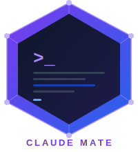

<p align="center">
  
</p>

<h1 align="center">Claude Mate Agent</h1>

<p align="center">
  <em>Enterprise-grade <a href="https://claude.ai/code">Claude Code</a> agent platform for Kubernetes and Red Hat OpenShift.</em>
</p>

<!-- Live build / release banners — generated server-side, click through to the workflow run / release / docs site. -->
<p align="center">
  <a href="https://github.com/bigg01/claude-mate-agent/actions/workflows/ci.yml"></a>
  <a href="https://github.com/bigg01/claude-mate-agent/actions/workflows/security.yml"></a>
  <a href="https://github.com/bigg01/claude-mate-agent/actions/workflows/pages.yml"></a>
  <a href="https://github.com/bigg01/claude-mate-agent/releases/latest"></a>
  <a href="https://github.com/bigg01/claude-mate-agent/pkgs/container/claude-mate-agent%2Fclaude-mate-agent"></a>
  <a href="https://github.com/bigg01/claude-mate-agent/blob/main/LICENSE"></a>
</p>

<p align="center">
  
  
  
  
  
  
  
  
</p>

---

Claude Mate Agent packages the [Claude Code CLI](https://claude.ai/code) as a production-grade Kubernetes workload with defense-in-depth security, multi-provider LLM routing, full DORA-metric telemetry, and an SDLC quality-gate pipeline. The runtime image is built from `ubi9-minimal` with no package managers, no Python interpreter, and no build tools in the final layer.

## Key capabilities

| Pillar | What you get |
|---|---|
| **Execution** | Static long-running Deployment · on-demand CI/CD Job · isolated [sandbox](docs/sandbox.md) (one-shot K8s Job with gVisor / Kata / experimental NVIDIA OpenShell, ephemeral workspace, TTL cleanup) |
| **Connectivity** | Direct Anthropic · Kong AI Gateway · LiteLLM · OpenRouter · Azure AI Foundry · Vertex AI · NVIDIA NIM · **local Ollama / vLLM / LM Studio** (air-gapped, no API key) — switch with one Helm value, no image rebuild ([details](docs/llm-gateway.md)) |
| **Personas** | Architect · Security · DevOps · SRE — each with a curated system prompt and Claude CLI tool allow-list (security persona is read-only) |
| **Guardrails** | Five opt-in runtime controls — [cost cap](docs/guardrails.md) · input/output content scrubbing (api-keys / credentials / PII / RFC1918) · `.claudeignore` workspace allowlist · per-persona intent denylist. Each is independent; zero overhead when disabled. |
| **Routing** | Kubernetes Ingress · OpenShift Route · Gateway API HTTPRoute — same chart, capability-gated templates |
| **GitOps** | ArgoCD `Application` and FluxCD `HelmRelease` examples with automated sync, pruning, and self-heal |
| **Observability** | Always-on Prometheus `/metrics` · opt-in OTEL OTLP · Grafana **agent** + **DORA** dashboards auto-provisioned · structured JSON audit logs |
| **Quality gates** | Trivy CVE + IaC scan · Bandit + Semgrep SAST · Gitleaks · CycloneDX SBOM · pytest coverage with `--cov-fail-under` floor · Renovate for deps |
| **DORA telemetry** | Deployment Frequency, Lead Time, Change Failure Rate, MTTR — emitted from every CI deploy job ([details](docs/dora-metrics.md)) |
| **Enterprise infra** | Artifactory mirrors for Docker/PyPI/npm/Helm · NVIDIA Container Runtime for GPU · Vault Agent Injector + Secrets Operator · cert-manager integration |

## Defense-in-depth protection

Seven independent security layers, each useful even if every other layer is breached:

| # | Layer | Controls |
|---|---|---|
| 1 | **Image** | `ubi9-minimal` base · no pip/npm/dnf/python in runtime · PyInstaller-compiled single binary · Renovate-tracked base/dep versions |
| 2 | **Container** | `readOnlyRootFilesystem: true` · `runAsNonRoot` + arbitrary UID for OpenShift SCC · `capabilities.drop: ALL` · seccomp `RuntimeDefault` · pinned Claude Code CLI version |
| 3 | **Network** | NetworkPolicy enabled by default · operator-defined egress allow-list · sandbox NetworkPolicy blocks all ingress · RFC 1918 excluded from default sandbox egress |
| 4 | **Sandbox** | One-shot K8s Job · `automountServiceAccountToken: false` · optional gVisor / Kata / experimental [NVIDIA OpenShell](docs/sandbox.md#nvidia-openshell-experimental) `runtimeClassName` (the last with inference-routing policy) · `activeDeadlineSeconds` hard cap · `ttlSecondsAfterFinished` auto-cleanup · ephemeral `/workspace` volume |
| 5 | **Identity** | API key from K8s Secret (never image-baked) · persona-bound Claude tool allow-list (`security` is read-only) · passive SIEM audit annotations on every pod · Vault Agent Injector option |
| 6 | **Content / DLP** | Runtime [guardrails](docs/guardrails.md): per-task + hourly cost cap · pre-flight input scrubbing · post-task output scrubbing (redact or block on api-keys, PEM, SSN, CC, RFC1918) · `.claudeignore` workspace allowlist · per-persona intent denylist. All opt-in via Helm. |
| 7 | **Supply chain** | Trivy `image` + `fs` + `config` (fixed CRITICAL/HIGH blocks merge) · Bandit + Semgrep SAST (SARIF → Code Scanning) · Gitleaks secret scan · Syft CycloneDX SBOM (90-day retention) · `.trivyignore` + `.gitleaks.toml` allowlists with rationale |

See [Security & Compliance](docs/security.md) and [Security Scanning](docs/security-scanning.md) for the full controls catalogue.

## Quick start

### Fully local — no API key, no cloud (recommended first run)

```bash
# Boot agent + Ollama + LiteLLM together; LiteLLM bridges Anthropic ↔ OpenAI
docker compose -f docker-compose.yml -f docker-compose.local-llm.yml up --build

# One-time: pull a model into Ollama
docker compose -f docker-compose.yml -f docker-compose.local-llm.yml \
  exec ollama ollama pull llama3.1:8b

# Run a one-shot task against the local model — no ANTHROPIC_API_KEY needed
CLAUDE_TASK="say hello in exactly three words" \
  docker compose -f docker-compose.yml -f docker-compose.local-llm.yml \
  run --rm agent --once
```

### Against the real Anthropic API

```bash
# Build the image (auto-detects podman or docker)
make build

# Run the static server (health + metrics on :8080)
make run

# Run an on-demand Claude task locally
export ANTHROPIC_API_KEY=sk-ant-...
export CLAUDE_TASK="summarise the open issues in this repo"
make run-once

# Spin up the full observability stack (agent + Prometheus + Grafana + Pushgateway)
docker compose up
```

Grafana opens at <http://localhost:3000> with the **Claude Mate Agent** and **DORA Metrics** dashboards pre-loaded.

## Local quality gates

```bash
make test          # pytest + coverage (50% floor)
make sast          # Bandit Python SAST
make scan          # Trivy filesystem + IaC + image
make secrets       # Gitleaks
make sbom          # Syft → sbom.cyclonedx.json
make security      # all of the above, sequentially
```

## What's inside

| Component | Description |
|---|---|
| `container/app.py` | Python wrapper — health/readiness/metrics server, persona-aware Claude subprocess runner, cost-tracking + audit |
| `container/tests/` | pytest unit tests + coverage config (50% floor) |
| `Dockerfile` | 3-stage multi-stage build: `python-builder` (uv + PyInstaller) → `node-builder` (npm + claude CLI) → `ubi9-minimal` runtime |
| `charts/claude-mate-agent` | Helm chart — Ingress · Route · Gateway API HTTPRoute · sandbox Job · NetworkPolicy · cert-manager · Vault · NVIDIA GPU |
| `examples/` | Deployment overlays: static-kubernetes · static-openshift · gateway-api · monitoring · on-demand-gitlab · on-demand-github · argocd · fluxcd · personas · sandbox · nvidia-gpu · **llm-gateway** (10 providers including Ollama / vLLM / LM Studio) · **mcp-deploy** (drive `kubernetes-mcp-server` from Claude Code) |
| `docker-compose.*.yml` | Opt-in local overlays: `local-llm` (Ollama + LiteLLM) · `opensearch` (audit-log sink test) · `nvidia` (GPU passthrough) · `artifactory` (corporate mirror) |
| `grafana/dashboards/` | `claude-mate-agent.json` + `dora-metrics.json` — auto-provisioned |
| `prometheus/` | Scrape config + `dora_rules.yml` (recording + alerting) |
| `scripts/dora-emit.sh` | Canonical DORA event emitter (deploy / failure / restore) |
| `.github/workflows/` | `ci.yml` (test + build + push) · `security.yml` (Trivy + Bandit + Semgrep + Gitleaks + SBOM → SARIF) · `deploy.yml` · `sandbox.yml` · `on-demand.yml` |
| `.gitlab-ci.yml` | `validate → test → build → scan → package → deploy → on-demand` with full quality-gate gating |
| `.github/renovate.json` | Renovate config for Python, Node, Dockerfile, Helm, Compose, Actions |

## Operating modes

| Mode | Lifecycle | When to use | How it runs |
|---|---|---|---|
| **Static** | Long-running Deployment | Always-on service with continuous metrics/health endpoints | `make run` / `helm upgrade --install` |
| **On-demand** | Short-lived CI job | Manual or scheduled tasks triggered from CI/CD | GitHub Actions `on-demand.yml` / GitLab `run:on-demand-agent` |
| **Sandbox** | One-shot K8s Job | Untrusted prompts, contractor work, per-request isolation | `helm template ... \| kubectl create -f -` ([details](docs/sandbox.md)) |

## Observability

The platform emits three classes of telemetry:

1. **Service metrics** — `claude_mate_agent_*` on `/metrics` (always on) and OTLP (opt-in via `OTEL_ENABLED=true`)
2. **Cost + audit** — structured JSON with `task_cost_summary`, role, CI system, commit SHA, pod identifiers
3. **DORA** — `dora_deployments_total`, `dora_lead_time_seconds`, `dora_change_failures_total`, `dora_restore_seconds` emitted via Pushgateway, surfaced on the Grafana DORA dashboard

DORA failure definition is codified in CI: rollout timeout, probe failure, or explicit `dora-emit.sh failure` within 24 h of deploy. Targets and alerting rules are in [`docs/dora-metrics.md`](docs/dora-metrics.md).

## Documentation

Full docs in [`docs/`](docs/), served with MkDocs Material:

```bash
make docs-serve        # live preview at http://localhost:8000
make docs-build        # build static site to site/
```

| Page | Purpose |
|---|---|
| [Getting Started](docs/getting-started.md) | Build, run, first task |
| [Local Development](docs/local-dev.md) | Compose overlays · fully-local Ollama stack · GPU passthrough |
| [Solution Architecture](docs/solution-architecture.md) | End-to-end reference architecture |
| [Container Internals](docs/architecture.md) | Two-layer design (agent + claude CLI), graceful shutdown |
| [Container Build](docs/container.md) | Multi-stage Dockerfile, PyInstaller, OTEL bundling |
| [Helm Chart](docs/helm-chart.md) | Values reference, routing, secrets |
| [GitLab CI/CD](docs/gitlab-ci.md) | Pipeline jobs and required variables |
| [GitHub Actions](docs/github-actions.md) | Workflows and required secrets |
| [Deploy via MCP](docs/mcp-deploy.md) | Drive `kubernetes-mcp-server` from Claude Code for interactive deploys |
| [Personas](docs/personas.md) | Architect / Security / DevOps / SRE roles |
| [LLM Gateway](docs/llm-gateway.md) | Provider routing — Anthropic, Kong, LiteLLM, OpenRouter, Azure, Vertex AI, NVIDIA NIM, **Ollama / vLLM / LM Studio** |
| [Sandboxes](docs/sandbox.md) | Ephemeral one-shot Job execution · gVisor / Kata / **NVIDIA OpenShell** runtimes |
| [Guardrails](docs/guardrails.md) | Cost cap · input/output scrubbing · workspace allowlist · intent denylist |
| [Monitoring](docs/monitoring.md) | Metrics reference, OTEL setup, ServiceMonitor |
| [Security & Compliance](docs/security.md) | RBAC, SCC, NetworkPolicy, audit |
| [Security Scanning](docs/security-scanning.md) | Trivy, Bandit, Semgrep, Gitleaks, SBOM |
| [Quality Gates](docs/quality-gates.md) | SDLC stage → gate matrix, pipeline DAG |
| [DORA Metrics](docs/dora-metrics.md) | Definitions, targets, dashboard, alerting |
| [Versioning](docs/versioning.md) | SemVer scheme, release tags, version-bump helper |

## Requirements

See [`requirement.md`](requirement.md) for the full enterprise requirements catalogue covering Kubernetes/OpenShift support, container hardening, monitoring, logging, OpenShell protection, audit trail, remote log sync, team-mate roles, LLM gateways, GPU support, Artifactory mirrors, Claude sandboxes, security scanning, SAST, code coverage, SDLC quality gates, and DORA metrics.
