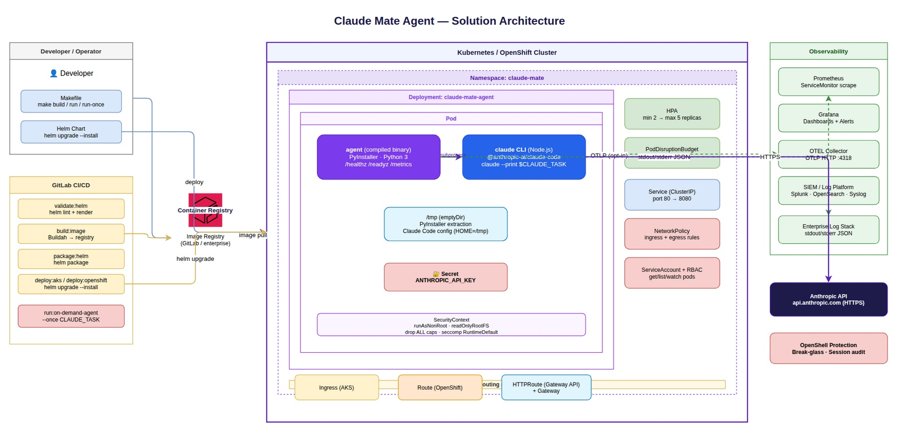

# Solution Architecture

{ loading=lazy }

The diagram source lives in [`docs/assets/architecture.drawio`](assets/architecture.drawio); the rendered JPEG above is regenerated from it with `make docs-diagrams` (requires the `drawio` CLI on `PATH`). Open the source with [draw.io Desktop](https://github.com/jgraph/drawio-desktop/releases) or [app.diagrams.net](https://app.diagrams.net) to edit.

---

## System diagram (ASCII fallback)

```
┌──────────────────────────────────────────────────────────────────────────────────────┐
│  Developer / Operator                                                                │
│  ┌─────────────────────┐   ┌──────────────────────────────┐                         │
│  │  make build/run     │   │  helm upgrade --install      │                         │
│  └────────┬────────────┘   └──────────────┬───────────────┘                         │
└───────────│────────────────────────────────│────────────────────────────────────────┘
            │ docker push                    │ deploy
            ▼                                ▼
┌───────────────────────┐   ┌────────────────────────────────────────────────────────┐
│  GitLab CI/CD         │   │  Kubernetes / OpenShift Cluster                        │
│                       │   │  ┌──────────────────────────────────────────────────┐  │
│  validate:helm        │   │  │  Namespace: claude-mate                          │  │
│  build:image ─────────┼───┼─▶│  ┌────────────────────────────────────────────┐ │  │
│     (Buildah)         │   │  │  │  Deployment                                │ │  │
│  package:helm         │   │  │  │  ┌──────────────────────────────────────┐  │ │  │
│  deploy:aks/openshift─┼───┼─▶│  │  │  Pod                                │  │ │  │
│  run:on-demand ───────┼───┼─▶│  │  │  ┌───────────────┐ subprocess  ┌───┐│  │ │  │
│     (CLAUDE_TASK)     │   │  │  │  │  │ agent binary  │────────────▶│ claude ││  │ │  │
│                       │   │  │  │  │  │ /healthz      │             │ CLI   ││  │ │  │
│  Container Registry ◀─┼───┘  │  │  │  │ /readyz       │             │       ││  │ │  │
│  (image store)        │      │  │  │  │ /metrics      │             └───────┘│  │ │  │
└───────────────────────┘      │  │  │  └───────────────┘                      │  │ │  │
                               │  │  │         │  ANTHROPIC_API_KEY ◀─ Secret  │  │ │  │
                               │  │  │         │  /tmp emptyDir (writable)     │  │ │  │
                               │  │  │  └──────┼───────────────────────────────┘  │ │  │
                               │  │  │  HPA · PDB · Service · NetworkPolicy · RBAC│ │  │
                               │  │  │  Ingress │ Route │ HTTPRoute (choose one)  │ │  │
                               │  │  └──────────┼────────────────────────────────┘ │  │
                               │  └─────────────┼───────────────────────────────────┘  │
                               └───────────────-┼────────────────────────────────────--┘
                                                │
                   ┌────────────────────────────┼────────────────────────────┐
                   │                            │                            │
                   ▼                            ▼                            ▼
           ┌──────────────┐           ┌──────────────────┐         ┌──────────────────┐
           │  Prometheus  │           │  OTEL Collector  │         │  Enterprise Log  │
           │  /metrics    │           │  OTLP :4318      │         │  stdout/stderr   │
           │  scrape      │           │  (opt-in)        │         │  JSON → SIEM     │
           └──────┬───────┘           └────────┬─────────┘         └──────────────────┘
                  │                            │
                  ▼                            ▼
           ┌──────────────┐           ┌──────────────────┐
           │  Grafana     │           │  SIEM Platform   │
           │  Dashboards  │           │  Splunk /        │
           │  Alertmanager│           │  OpenSearch      │
           └──────────────┘           └──────────────────┘
```

---

## Component descriptions

### Developer / Operator

Interacts with the platform through the `Makefile` for local development and Helm CLI for cluster deployments. The `make build` target populates OCI labels (`VERSION`, `VCS_REF`, `BUILD_DATE`, `SOURCE_URL`) automatically.

### GitLab CI/CD

Five-stage pipeline:

| Stage | Job | Output |
|---|---|---|
| validate | `docs:build`, `validate:helm` | Rendered YAML artifacts |
| build | `build:image` | Image pushed to registry via Buildah |
| package | `package:helm` | `.tgz` chart artifact |
| deploy | `deploy:aks`, `deploy:openshift` | Live cluster update (manual) |
| on-demand | `run:on-demand-agent` | Claude Code task execution (manual) |

### Container Registry

Enterprise registry (GitLab Container Registry or external). Images are tagged with `$CI_COMMIT_SHORT_SHA` and `latest`. Image signing and vulnerability scanning are required before promotion to production.

### Kubernetes / OpenShift Cluster

All workload resources live in a dedicated `claude-mate` namespace. The `Deployment` runs at 2 replicas by default (configurable via HPA). Key in-cluster resources:

| Resource | Purpose |
|---|---|
| `Deployment` | Long-running agent pods with rolling update strategy |
| `HPA` | Horizontal autoscaling (CPU-based, 70% threshold) |
| `PodDisruptionBudget` | Ensures at least 1 replica during maintenance |
| `Service` (ClusterIP) | Internal load balancing to pods |
| `ServiceMonitor` | Prometheus Operator scrape target for `/metrics` |
| `NetworkPolicy` | Restricts ingress and egress traffic |
| `ServiceAccount` + `RBAC` | Least-privilege; only `get/list/watch` on pods |
| `Secret` | Holds `ANTHROPIC_API_KEY` — never in image or logs |
| Ingress / Route / HTTPRoute | Exactly one active per environment |

### Pod internals

Two processes run in the single container:

1. **`agent` binary** (compiled Python) — HTTP server providing health probes and Prometheus metrics; in `--once` mode, spawns `claude` as a subprocess.
2. **`claude` CLI** (Node.js) — the Anthropic Claude Code runtime; invoked on-demand via `claude --print $CLAUDE_TASK`.

The container has a read-only root filesystem. The only writable path is `/tmp` (emptyDir), used for PyInstaller self-extraction and Claude Code's config (`HOME=/tmp`).

### Observability

| Component | Connection | Purpose |
|---|---|---|
| Prometheus | Scrapes `/metrics` via ServiceMonitor | Agent health, uptime, request counters |
| Grafana | Reads Prometheus | Operational dashboards |
| OTEL Collector | Receives OTLP HTTP from agent (opt-in) | Metrics forwarding to observability platform |
| Enterprise Log Stack | Collects stdout/stderr from pods | Structured JSON audit and application logs |
| SIEM | Receives forwarded logs | Security monitoring, compliance, incident response |

### Anthropic API

The `claude` CLI calls `api.anthropic.com` over HTTPS using the `ANTHROPIC_API_KEY` injected at runtime from the Kubernetes Secret. Egress NetworkPolicy should restrict outbound traffic to port 443 only.

### OpenShell Protection

Enterprise OpenShell webhook intercepts container exec requests. Pod annotations (`openshell.io/protection: restricted`) activate the policy. All shell sessions require break-glass approval and are fully audited.

---

## Deployment topology

```
                    ┌───────────────────────────────────────────────┐
                    │              Production Cluster                │
  Internet ────────▶│  Ingress / Route / Gateway  ──▶  Service     │
                    │                                      │         │
                    │                                      ▼         │
                    │                          ┌─────────────────┐  │
                    │                          │   Pod  replica 1│  │
                    │                          ├─────────────────┤  │
                    │                          │   Pod  replica 2│  │
                    │                          └─────────────────┘  │
                    │                                               │
                    │  Monitoring Namespace:  Prometheus / Grafana  │
                    └───────────────────────────────────────────────┘

                    ┌───────────────────────────────────────────────┐
                    │              GitLab Runner (on-demand)         │
                    │  run:on-demand-agent                           │
                    │  └─▶ agent --once                             │
                    │        └─▶ claude --print "$CLAUDE_TASK"      │
                    │              └─▶ api.anthropic.com (HTTPS)    │
                    └───────────────────────────────────────────────┘
```
